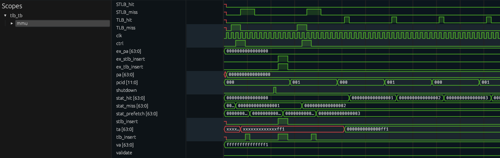

# Simple TLB (Translation lookaside buffer) realization on verilog. 

<!--  -->

	

## (S)TLB
This TLB implements a 64 entries, 8-way set associative, cache with PLRU replacement policy. The second level TLB (STLB) implements 12-way set associative cache with 96 entries inside, managing by ${(MRU+1)}_{\\%3}$ $PLRU_4$ policy. 
- - -

  
&nbsp; &nbsp; &nbsp; &nbsp;
  

## MMU
MMU (memory management unit): it behaves like memory controller. In this way, providing connections and behavior managing between PMU, TLB and STLB.

## PMU
PMU (performance management unit): provides general statistical collection capabilities generated by both caches.

## Inclusion policy 
* First level miss is followed by checking STLB.
* Hit in the second level causes insert to the TLB.
* Miss in the second level is followed by insertions to both levels. 

## PCID feature
This set contains with PCID (process context identifiers) feature for PTE is used by Intel to improve performance of paging structure.
